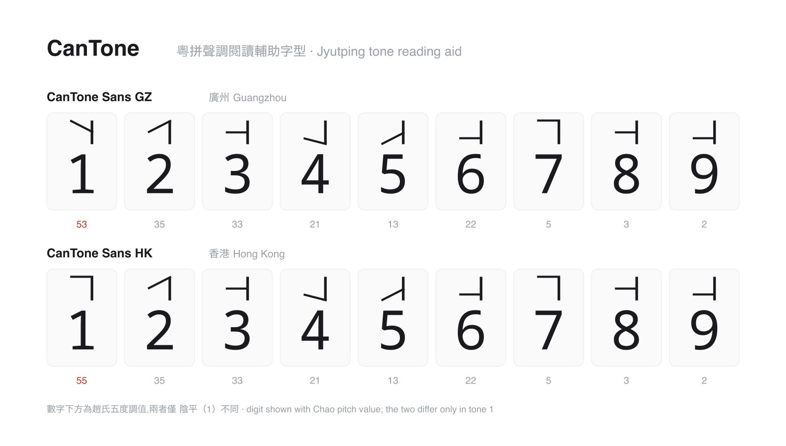
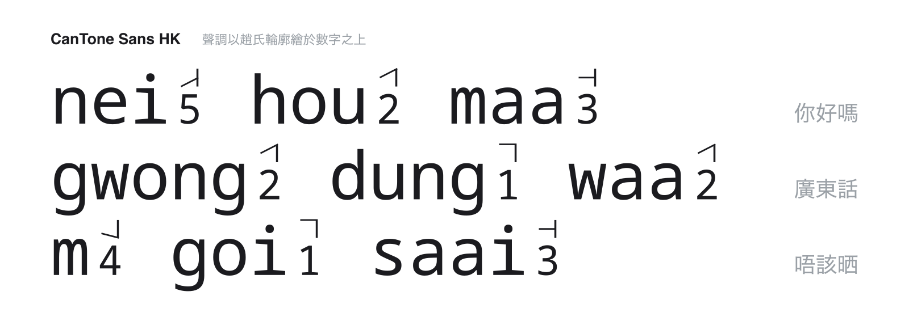

# CanTone

[繁體中文](README.md) · **简体中文** · [English](README-en.md) · [日本語](README-ja.md)

**把粤拼声调数字 1–9 变成音高轮廓的阅读辅助字型。**

CanTone 会把粤拼（Jyutping）的声调数字 **1–9** 渲染成「数字 + 赵氏五度声调轮廓」，
让你一眼看出每个音节的音高走向，而不必死记每个数字代表什么调。



## 简介

读粤拼时，`nei5 hou2` 里的数字就是声调标记，但初学者往往记不住「5 是低升、2 是中升」。
CanTone 保留原本的数字，只在它上方画一条赵元任五度标记法的音高轮廓——把抽象的数字变成
看得见的音高。整套字型以等宽的 Noto Sans Mono 为基础，并保留全部可打印 ASCII，因此整段粤拼都能用同一个字型显示。



## 声调画法

CanTone 用赵氏五度标记法的音高轮廓来标注每个声调：

| 调型 | 数字 | 画法 |
| --- | --- | --- |
| **平调** | 1、3、6、7、8、9 | 一条水平横线（音高不变） |
| **曲折调** | 2、4、5 | 一条连起来的斜线（音高上升或下降） |

竖标一律位于右侧，沿用中文五度标记法的惯例。

## 两种标准：香港与广州

CanTone 提供两个字型，差别**只在阴平（第 1 声）**：

| 字型 | 阴平（1） | 其余各调 |
| --- | --- | --- |
| **CanTone Sans HK**（香港） | 高平 `55`（水平横线） | 相同 |
| **CanTone Sans GZ**（广州） | 高降 `53`（下降斜线） | 相同 |

这是港穗粤语唯一有充分文献支持的调值差异：广州（及老派）保留高降 53，当代香港多已并入
高平 55。其余六调两地一致，学界并无另立两套调值。

## 声调对照表

5 为最高音；7／8／9 为入声（促音），音高分别与 1／3／6 相同。

| 数字 | 1 | 2 | 3 | 4 | 5 | 6 | 7 | 8 | 9 |
| --- | --- | --- | --- | --- | --- | --- | --- | --- | --- |
| 调类 | 阴平 | 阴上 | 阴去 | 阳平 | 阳上 | 阳去 | 阴入 | 中入 | 阳入 |
| 香港 HK | 55 | 35 | 33 | 21 | 13 | 22 | 5 | 3 | 2 |
| 广州 GZ | 53 | 35 | 33 | 21 | 13 | 22 | 5 | 3 | 2 |

## 下载

到 [Releases](https://github.com/satoi8080/CanTone/releases) 下载最新的 `CanToneSans-*.zip`，解压后即得
`CanToneSansHK-Regular.ttf`、`CanToneSansGZ-Regular.ttf` 与字型授权 `OFL.txt`。

## 使用方式

- **编辑器／终端**：把字型设为 `CanTone Sans HK` 或 `CanTone Sans GZ`。
- **网页**：`font-family: 'CanTone Sans HK', monospace;`

安装：在 macOS／Windows 双击 `.ttf` 安装，或在 Linux 复制到 `~/.fonts/`。

## 授权

本仓库分两部分授权：

- **字型**（CanTone Sans HK／GZ）：[SIL Open Font License 1.1](OFL.txt)。字型以
  [Noto Sans Mono](https://fonts.google.com/noto/specimen/Noto+Sans+Mono)（同为 OFL 1.1）构建，
  依 OFL 条款，衍生字型须同样以 OFL 发布。
- **源码与构建工具**：[MIT](LICENSE)。

与同作者的 [KanaKira](https://github.com/satoi8080/KanaKira) 为姊妹项目，理念一脉相承。

---

> 以下为开发者内容；一般使用者读到这里即可。

## 从源码构建

需要 Python 3.12+ 与 [uv](https://docs.astral.sh/uv/)。

```bash
uv sync
uv run main.py          # 生成 CanToneSansHK / CanToneSansGZ 两个 .ttf
uv run python scripts/gen_preview.py   # 重新生成预览 SVG（再用 inkscape 等转成 PNG）
uv run python scripts/package.py       # 打包成 CanToneSans-v<版本>.zip（含 OFL.txt）
```

字形几何（数字缩放、声调框尺寸、笔画粗细、竖标位置）可在 `config.json` 调整；
两套调值（`TONES_HK` 与 `TONES_GZ`）在 `main.py`。
